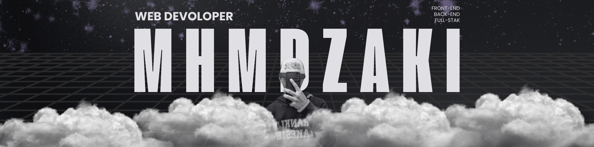

<!--Banner-->

<h1 align="left">👨‍💻 Muhammad Zaki | Web Developer</h1>

###

<h4 align="left">🌍 Based in Indonesia | 💡 Innovating with Laravel & Next.js</h4>

###

<h2 align="left">📌 About Me</h2>

###

I am a passionate web developer with a focus on creating efficient, scalable, and user-centric digital solutions. My expertise lies in building dynamic platforms for e-learning, event management, and website services.

###

<h2 align="left">🔑 Core Skills:</h2>

###

- Proficient in Laravel, Next.js, TailwindCSS, HTML, CSS, and JavaScript - Strong background in designing admin dashboards and interactive user interfaces - Experienced in integrating payment gateways and real-time notifications

###

  
  
  
  
  
  
  
  
  
  
  
  
  
  
  
  
  

   

###

<h2 align="left">📈 What I’m Working On:</h2>

###

🚀 Improving online course platforms for better engagement 🎮 Building web-based games with seamless user experiences 🛠️ Exploring modern frameworks for optimized development

###

<h2 align="left">🌟 Values I Bring:</h2>

###

-High attention to detail in code and design -A problem-solving mindset with a passion for learning new technologies -Collaboration-oriented approach to deliver exceptional results

 
<picture>
  <source media="(prefers-color-scheme: dark)" srcset="https://raw.githubusercontent.com/platane/platane/output/github-contribution-grid-snake-dark.svg">
  <source media="(prefers-color-scheme: light)" srcset="https://raw.githubusercontent.com/platane/platane/output/github-contribution-grid-snake.svg">
  
</picture>
<!--  
 
<picture>
  <source media="(prefers-color-scheme: dark)" srcset="https://raw.githubusercontent.com/MuhammadZaki07/MuhammadZaki07/output/pacman-contribution-graph-dark.svg">
  <source media="(prefers-color-scheme: light)" srcset="https://raw.githubusercontent.com/MuhammadZaki07/MuhammadZaki07/output/pacman-contribution-graph.svg">
  
</picture> -->
 
 

  <a href="https://github.com/MuhammadZaki07">
    <picture>
      <source media="(prefers-color-scheme: dark)" srcset="https://github-profile-trophy.vercel.app/?username=MuhammadZaki07&no-bg=true&row=2&column=6&margin-w=20&margin-h=20&theme=darkhub">
      <source media="(prefers-color-scheme: light)" srcset="https://github-profile-trophy.vercel.app/?username=MuhammadZaki07&no-bg=true&row=2&column=6&margin-w=20&margin-h=20">
      
    </picture>
  </a>

 

  
  
  
  
  

